# Style Presets

Use style presets to customize the look and feel of your generated images.

## Understanding style presets

Firefly offers a collection of style presets to use with the [Generate Images API][1] that can give generated images a specific visual style or mood. By indicating these presets in the API request, you have more control, beyond the prompt, to create image variations.

Style presets are defined in the `presets` array in the Generate Images API request. All presets in the array apply to the generated image. To influence the impact of the presets, add or adjust the `strength` value.

<CodeBlock slots="heading, code" languages="JSON" />

Request parameter for presets

```json
// ... API request cURL ...
--data '{
    "prompt": "a puppy dressed as a renaissance artist",
    "numVariations": 4,
    "style": {
        // array of style presets for image variations
        "presets": [   
            "bw", "fantasy", "dramatic_light"
        ],
        "strength": 100
    }
}'
```

## Style Presets examples

Here are the style presets available and examples of the images they generate. Use these presets, in snake_case, in the API request.

||||
| --- | --- | --- |
| 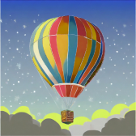 graphic | 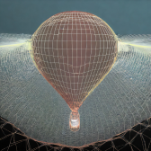 wireframe | 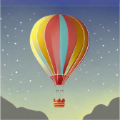 vector_look
|  bw | 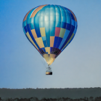 cool_colors | 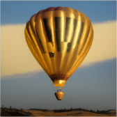 golden
| 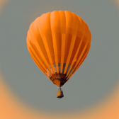 monochromatic |  muted_color | 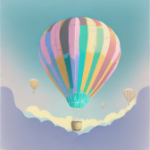 pastel_color
|  toned_image |  vibrant_colors |  warm_tone
|  closeup | 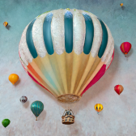 knolling | 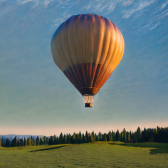 landscape_photography
| 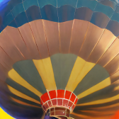 macrophotography | 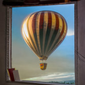 photographed_through_window |  shallow_depth_of_field
|  shot_from_above | 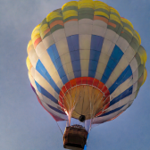 shot_from_below | 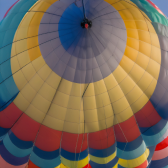 surface_detail
| 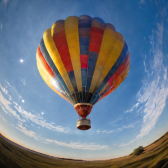 wide_angle | 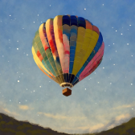 beautiful | 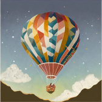 bohemian
| 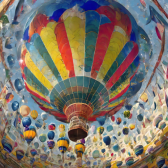 chaotic | 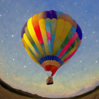 dais |  divine
| 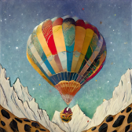 eclectic |  futuristic | 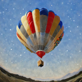 kitschy
| 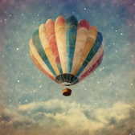 nostalgic | 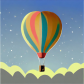 simple | 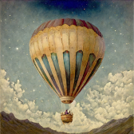 antique_photo
| 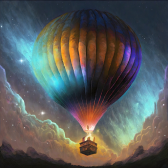 bioluminescent |  bokeh | 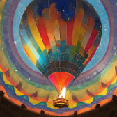 color_explosion
| 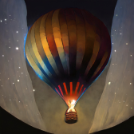 dark | 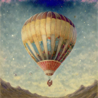 faded_image | 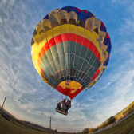 fisheye
| 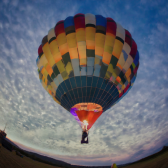 gomori_photography |  grainy_film | 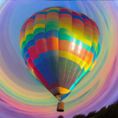 iridescent
| 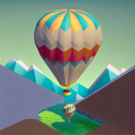 isometric | 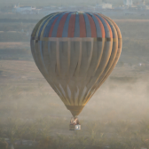 misty | 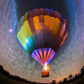 neon
| 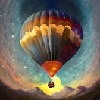 otherworldly_depiction | 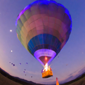 ultraviolet | 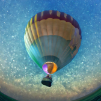 underwater
|  backlighting |  dramatic_light |  golden_hour
|  harsh_light |  long | 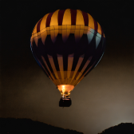 low_lighting
| 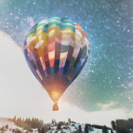 multiexposure | 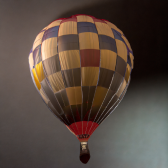 studio_light | 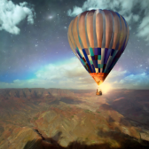 surreal_lighting
| 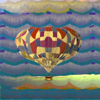 3d_patterns | 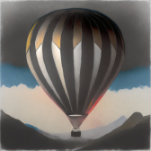 charcoal |  claymation
| 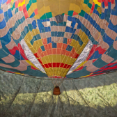 fabric |  fur | 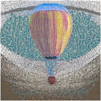 guilloche_patterns
| 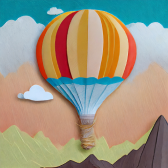 layered_paper | 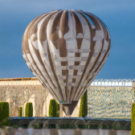 marble_sculpture | 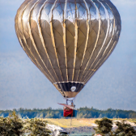 made_of_metal
| 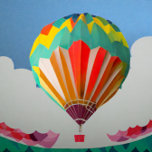 origami | 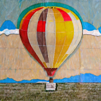 paper_mache | 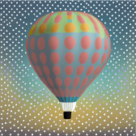 polka
|  strange_patterns |  wood_carving |  yarn
|  art_deco |  art_nouveau |  baroque
|  bauhaus |  constructivism |  cubism
|  cyberpunk |  fantasy |  fauvism
|  film_noir |  glitch_art |  impressionism
|  industrialism |  maximalism |  minimalism
|  modern_art |  modernism |  neo
|  pointillism |  psychedelic |  science_fiction
|  steampunk |  surrealism |  synthetism
|  synthwave |  vaporwave |  acrylic_paint
|  bold_lines |  chiaroscuro |  color_shift_art
|  daguerreotype |  digital_fractal |  doodle_drawing
|  double_exposure_portrait |  fresco |  geometric_pen
|  halftone |  ink |  light_painting
|  line_drawing |  linocut |  oil_paint
|  paint_spattering |  painting |  palette_knife
|  photo_manipulation |  scribble_texture | sketch
|  splattering |  stippling_drawing |  watercolor
|  3d |  anime |  cartoon
|  cinematic |  comic_book |  concept_art
|  cyber_matrix |  digital_art |  flat_design
|  geometric |  glassmorphism |  glitch_graphic
|  graffiti |  hyper_realistic |  interior_design
|  line_gradient |  low_poly |  newspaper_collage
|  optical_illusion |  pattern_pixel |  pixel_art
|  pop_art |  product_photo |  psychedelic_background
|  psychedelic_wonderland |  scandinavian |  splash_images
|  stamp |  trompe_loeil

## Concepts in action

Let's use style presets to generate a few image variations.

<InlineAlert variant="warning" slots="heading, text" />

Before you start

You'll need a Firefly **Client ID** and **Access Token** for this exercise. Learn how to retrieve them in the [Authentication Guide][2]. **Securely store these credentials and never expose them in client-side or public code.**

1. First, open a secure terminal and `export` your **Client ID** and **Access Token** as environment variables:

```bash
export FIREFLY_SERVICES_CLIENT_ID=<your_Client_ID>
export FIREFLY_SERVICES_ACCESS_TOKEN=<your_Access_Token>
```

2. Next, make the request to the Generate Images API. We'll use a prompt for a Shakespearean puppy, and enter a few presets so that they apply together:

```bash
curl --location 'https://firefly-api.adobe.io/v3/images/generate-async' \
--header 'Content-Type: application/json' \
--header 'Accept: application/json' \
--header "x-api-key: $FIREFLY_SERVICES_CLIENT_ID" \
--header "Authorization: Bearer $FIREFLY_SERVICES_ACCESS_TOKEN" \
--data '{
    "prompt": "a puppy dressed as a renaissance artist",
    "numVariations": 4,
    "style": {
        "presets": [
            "bw", "fantasy", "dramatic_light"
        ]
    }
}'
```

The request returns a rapid response for the asynchronous job:

```json
{   
    "jobId":"<YOUR_JOB_ID>",
    "statusUrl":"https://firefly-epo854211.adobe.io/v3/status/urn:ff:jobs:...",
    "cancelUrl":"https://firefly-epo854211.adobe.io/v3/cancel/urn:ff:jobs:..."
}
```

3. Use the `jobId` to see the result:

<InlineAlert variant="info" slots="heading, text" />

NOTE

The `numVariations` value creates four generated images that will be easy to compare. Four URLs are returned in the response.

```bash
curl -X GET "https://firefly-api.adobe.io/v3/status/<YOUR_JOB_ID>" \
    -H "x-api-key: $FIREFLY_SERVICES_CLIENT_ID" \
    -H "Authorization: Bearer $FIREFLY_SERVICES_ACCESS_TOKEN" \
    -H "Content-Type: application/json"
```

You'll see results similar to our example below. Notice that all the defined presets were applied to the prompt for a renaissance puppy!

**Sample Result**

![A renaissance artist puppy generated with presets][3]

[//]: # (links)
[1]: ../../api/
[2]: ../../../getting-started/index.md
[3]: ../../images/puppy-renaissance-artist.jpeg
