# Compositing feature guide

The Firefly API includes a suite of compositing operations for integrating objects into scenes with realistic lighting, shadows, and image harmonization. There are three distinct compositing operations available, each designed for a different workflow and level of creative control.

All three operations are asynchronous. Each request returns a `jobId` and a `statusUrl` for polling job status.

The three composite operations are:

- **Generate Object Composite** generates a background from a text prompt and composites your object into it. Use when no background image exists yet.
- **Precise Composite** places an object into an existing background with pixel-perfect subject fidelity. Use when the subject must not be altered.
- **Adaptive Composite** composites an object into an existing background by adapting and regenerating the subject to match the scene. Use when realism and seamless integration are the priority.

For full technical details, see the [Object Composite API Reference](../../../api/index.md).

## Which API should I use?

Use this decision tree to determine the right endpoint for your use case:



## Generate Object Composite

This service generates a background from a prompt and composites the object into that background.
Use this service when you have an object image ready and need a background created for a final asset.

Execute this operation using an object composite request with the endpoint `/v3/images/generate-object-composite-async`.

### Example requests

<AccordionItem slots="heading, text"/>

#### JavaScript

```javascript
const axios = require('axios');

const API_BASE = 'https://firefly-api.adobe.io';
const ACCESS_TOKEN = 'your_access_token';
const API_KEY = 'your_api_key';

async function generateObjectComposite() {
  const payload = {
    prompt: 'a product on a wooden table in a cozy kitchen',
    image: {
      source: { url: 'https://example.com/product.png' }
    }
  };

  const response = await axios.post(
    `${API_BASE}/v3/images/generate-object-composite-async`,
    payload,
    {
      headers: {
        'Authorization': `Bearer ${ACCESS_TOKEN}`,
        'x-api-key': API_KEY,
        'Content-Type': 'application/json'
      }
    }
  );

  console.log('Job ID:', response.data.jobId);
  console.log('Status URL:', response.data.statusUrl);
  console.log('Cancel URL:', response.data.cancelUrl);
  return response.data;
}

generateObjectComposite();
```

<AccordionItem slots="heading, text"/>

#### Python

```python
import requests

API_BASE = "https://firefly-api.adobe.io"
ACCESS_TOKEN = "your_access_token"
API_KEY = "your_api_key"

headers = {
    "Authorization": f"Bearer {ACCESS_TOKEN}",
    "x-api-key": API_KEY,
    "Content-Type": "application/json"
}

payload = {
    "prompt": "a product on a wooden table in a cozy kitchen",
    "image": {
        "source": { "url": "https://example.com/product.png" }
    }
}

response = requests.post(
    f"{API_BASE}/v3/images/generate-object-composite-async",
    headers=headers,
    json=payload
)
response.raise_for_status()
result = response.json()
print("Job ID:", result["jobId"])
print("Status URL:", result.get("statusUrl"))
print("Cancel URL:", result.get("cancelUrl"))
```

<AccordionItem slots="heading, text"/>

#### cURL

```bash
curl --location 'https://firefly-api.adobe.io/v3/images/generate-object-composite-async' \
  --header 'Authorization: Bearer $ACCESS_TOKEN' \
  --header 'x-api-key: $API_KEY' \
  --header 'Content-Type: application/json' \
  --data '{
    "prompt": "a product on a wooden table in a cozy kitchen",
    "image": {
      "source": { "url": "https://example.com/product.png" }
    }
  }'
```

## Precise Composite

Precise Composite places an object into an existing background while preserving the subject exactly as provided.
Use this service when maintaining pixel-perfect fidelity of the subject is critical.

Execute this operation using a precise composite request with the endpoint `/v3/images/precise-composite`.

### Example request

<AccordionItem slots="heading, text"/>

#### JavaScript

```javascript
const axios = require('axios');

const API_BASE = 'https://firefly-api.adobe.io';
const ACCESS_TOKEN = 'your_access_token';
const API_KEY = 'your_api_key';

async function preciseComposite() {
  const payload = {
    background: {
      image: {
        source: { url: 'https://example.com/background.jpg' }
      },
      fillAreaMask: {
        source: { url: 'https://example.com/placement-mask.png' }
      }
    },
    object: {
      image: {
        source: { url: 'https://example.com/product.png' }
      }
    },
    blend: 0.5,
    output: { mediaType: 'image/jpeg' }
  };

  const response = await axios.post(
    `${API_BASE}/v3/images/precise-composite`,
    payload,
    {
      headers: {
        'Authorization': `Bearer ${ACCESS_TOKEN}`,
        'x-api-key': API_KEY,
        'Content-Type': 'application/json'
      }
    }
  );

  console.log('Job ID:', response.data.jobId);
  console.log('Status URL:', response.data.statusUrl);
  console.log('Cancel URL:', response.data.cancelUrl);
  return response.data;
}

preciseComposite();
```

<AccordionItem slots="heading, text"/>

#### Python

```python
import requests

API_BASE = "https://firefly-api.adobe.io"
ACCESS_TOKEN = "your_access_token"
API_KEY = "your_api_key"

headers = {
    "Authorization": f"Bearer {ACCESS_TOKEN}",
    "x-api-key": API_KEY,
    "Content-Type": "application/json"
}

payload = {
    "background": {
        "image": {
            "source": { "url": "https://example.com/background.jpg" }
        },
        "fillAreaMask": {
            "source": { "url": "https://example.com/placement-mask.png" }
        }
    },
    "object": {
        "image": {
            "source": { "url": "https://example.com/product.png" }
        }
    },
    "blend": 0.5,
    "output": { "mediaType": "image/jpeg" }
}

response = requests.post(
    f"{API_BASE}/v3/images/precise-composite",
    headers=headers,
    json=payload
)
response.raise_for_status()
result = response.json()
print("Job ID:", result["jobId"])
print("Status URL:", result.get("statusUrl"))
print("Cancel URL:", result.get("cancelUrl"))
```

<AccordionItem slots="heading, text"/>

#### cURL

```bash
curl --location 'https://firefly-api.adobe.io/v3/images/precise-composite' \
  --header 'Authorization: Bearer $ACCESS_TOKEN' \
  --header 'x-api-key: $API_KEY' \
  --header 'Content-Type: application/json' \
  --data '{
    "background": {
      "image": {
        "source": { "url": "https://example.com/background.jpg" }
      },
      "fillAreaMask": {
        "source": { "url": "https://example.com/placement-mask.png" }
      }
    },
    "object": {
      "image": {
        "source": { "url": "https://example.com/product.png" }
      }
    },
    "blend": 0.5,
    "output": { "mediaType": "image/jpeg" }
  }'
```

## Adaptive Composite

Adaptive Composite composites an object image into an existing background by adapting and regenerating the subject to match the scene.
Use when realism and seamless integration are the priority.

**Background Image**


**Product Image**


**Completed Composite**


Execute this operation using an adaptive composite request with the endpoint `/v3/images/adaptive-composite`.

### Background preservation

Adaptive Composite supports a `preserveBackground` parameter. When set to `true`, the original background pixels are retained and only the composited object region is modified. This is useful when you want to maintain specific background details — such as floor textures or brand environments — while still achieving natural object integration.

**Background Image**


**Product Image**


**Mask Area Image (white area is the dynamic, changeable area)**


**Completed Composite**


### Example request

<AccordionItem slots="heading, text"/>

#### JavaScript

```javascript
const axios = require('axios');

const API_BASE = 'https://firefly-api.adobe.io';
const ACCESS_TOKEN = 'your_access_token';
const API_KEY = 'your_api_key';

async function adaptiveComposite() {
  const payload = {
    background: {
      image: {
        source: { url: 'https://example.com/living-room.jpg' }
      },
      fillAreaMask: {
        source: { url: 'https://example.com/placement-mask.png' }
      }
    },
    object: {
      image: {
        source: { url: 'https://example.com/chair.png' }
      },
      mask: {
        source: { url: 'https://example.com/chair-mask.png' }
      }
    },
    preserveBackground: true,
    harmonization: 0.7,
    shadowIntensity: 1,
    seeds: [42, 84, 126],
    output: { mediaType: 'image/png' }
  };

  const response = await axios.post(
    `${API_BASE}/v3/images/adaptive-composite`,
    payload,
    {
      headers: {
        'Authorization': `Bearer ${ACCESS_TOKEN}`,
        'x-api-key': API_KEY,
        'Content-Type': 'application/json'
      }
    }
  );

  console.log('Job ID:', response.data.jobId);
  console.log('Status URL:', response.data.statusUrl);
  console.log('Cancel URL:', response.data.cancelUrl);
  return response.data;
}

adaptiveComposite();
```

<AccordionItem slots="heading, text"/>

#### Python

```python
import requests

API_BASE = "https://firefly-api.adobe.io"
ACCESS_TOKEN = "your_access_token"
API_KEY = "your_api_key"

headers = {
    "Authorization": f"Bearer {ACCESS_TOKEN}",
    "x-api-key": API_KEY,
    "Content-Type": "application/json"
}

payload = {
    "background": {
        "image": {
            "source": { "url": "https://example.com/living-room.jpg" }
        },
        "fillAreaMask": {
            "source": { "url": "https://example.com/placement-mask.png" }
        }
    },
    "object": {
        "image": {
            "source": { "url": "https://example.com/chair.png" }
        },
        "mask": {
            "source": { "url": "https://example.com/chair-mask.png" }
        }
    },
    "preserveBackground": True,
    "harmonization": 0.7,
    "shadowIntensity": 1,
    "seeds": [42, 84, 126],
    "output": { "mediaType": "image/png" }
}

response = requests.post(
    f"{API_BASE}/v3/images/adaptive-composite",
    headers=headers,
    json=payload
)
response.raise_for_status()
result = response.json()
print("Job ID:", result["jobId"])
print("Status URL:", result.get("statusUrl"))
print("Cancel URL:", result.get("cancelUrl"))
```

<AccordionItem slots="heading, text"/>

#### cURL

```bash
curl --location 'https://firefly-api.adobe.io/v3/images/adaptive-composite' \
  --header 'Authorization: Bearer $ACCESS_TOKEN' \
  --header 'x-api-key: $API_KEY' \
  --header 'Content-Type: application/json' \
  --data '{
    "background": {
      "image": {
        "source": { "url": "https://example.com/living-room.jpg" }
      },
      "fillAreaMask": {
        "source": { "url": "https://example.com/placement-mask.png" }
      }
    },
    "object": {
      "image": {
        "source": { "url": "https://example.com/chair.png" }
      },
      "mask": {
        "source": { "url": "https://example.com/chair-mask.png" }
      }
    },
    "preserveBackground": true,
    "harmonization": 0.7,
    "shadowIntensity": 1,
    "seeds": [42, 84, 126],
    "output": { "mediaType": "image/png" }
  }'
```

## Canceling a job

All three endpoints above are asynchronous. Each returns a **202 Accepted** response containing a `jobId`, a `statusUrl` for polling job status, and a `cancelUrl` for stopping the job if needed.

To cancel an in-progress job, send a `PUT` request to the `cancelUrl` from the initial response. A successful cancel typically returns **200** with an empty body.

<AccordionItem slots="heading, text"/>

### JavaScript

```javascript
async function cancelJob(cancelUrl) {
  const response = await axios.put(
    cancelUrl,
    {},
    {
      headers: {
        'Authorization': `Bearer ${ACCESS_TOKEN}`,
        'x-api-key': API_KEY,
        'Content-Type': 'application/json'
      }
    }
  );
  console.log('Job canceled:', response.status);
  return response.data;
}
```

<AccordionItem slots="heading, text"/>

### Python

```python
def cancel_job(cancel_url):
    response = requests.put(
        cancel_url,
        headers={
            "Authorization": f"Bearer {ACCESS_TOKEN}",
            "x-api-key": API_KEY,
            "Content-Type": "application/json"
        }
    )
    response.raise_for_status()
    print("Job canceled:", response.status_code)
    return response.json() if response.content else None
```

<AccordionItem slots="heading, text"/>

### cURL

```bash
curl --location --request PUT '$CANCEL_URL' \
  --header 'Authorization: Bearer $ACCESS_TOKEN' \
  --header 'x-api-key: $API_KEY' \
  --header 'Content-Type: application/json'
```

For full technical details, see the [Object Composite API Reference](../../../api/index.md).
