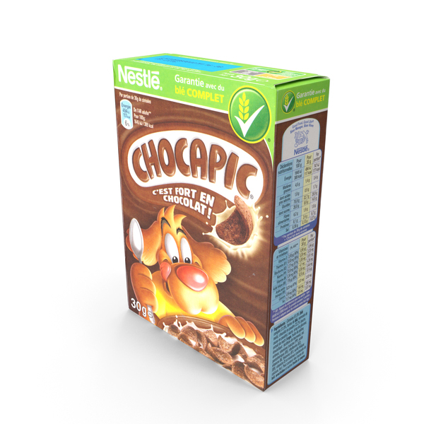
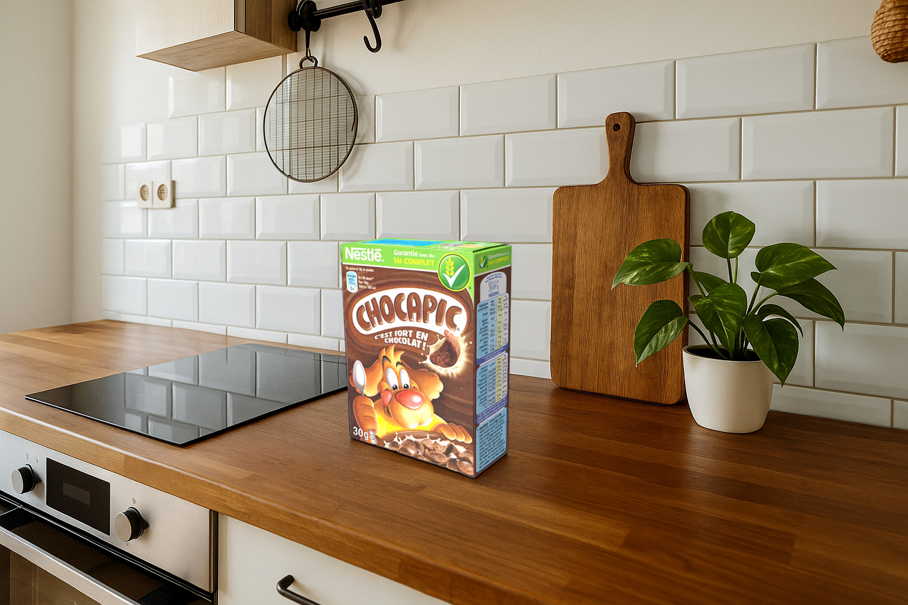

# Using the Object Composite API

This guide explains the Object Composite API and the key processing features it offers for generating composites with its various endpoints.

## Overview

The Object Composite API operations offer Adobe's enterprise-grade image compositing capabilities and other more specific compositing operations that unlocks new compositional workflows.

The API enables intelligent object insertion, replacement, and harmonization within images, with powerful capabilities for integrating objects into background scenes with realistic lighting, shadows, and harmonization.

For Object Composite operations there are a few choices:

- **Object Composite**: Adobe's enterprise-grade image compositing capability.

Execute this operations using a **object composite** request with the endpoint `/v3/images/generate-object-composite-async`.

- **PixelPerfect mode**: Places the subject in the masked region and applies generative harmonization so the subject blends naturally with the background. Use when you want AI-driven harmonization and a single, consistent style.

Execute this operations using a **precise composite** request with the endpoint `/v3/images/precise-composite`.

- **Object Stitch mode**: Composites the subject seamlessly into the background at the masked location, with control over shadows and background preservation. Use when you need seamless product compositing, context-aware alignment, and parameters such as `shadowIntensity` and `preserveBackground`.

Execute this operations using an **adaptive composite** request with the endpoint `/v3/images/adaptive-composite`.

### Inputs

The API is powerful in a variety of workflows but will often require these inputs:

- **Background image** - The destination scene where the object will be placed. For the best results, use:
  - Use high-resolution images (minimum 1024px on shortest side recommended).
  - Ensure good lighting and clarity.
  - Clean backgrounds (without objects) work best for object insertion.
- **Reference image** - The object to be composited into the background. For the best results:
  - Pre-segment objects with clean edges.
  - Include transparency or provide an accurate mask.
  - Ensure an object is properly lit for the best harmonization results.
- **Mask layer image** - A mask layer image (from Photoshop), indicating the areas of the destination scene where Firefly's AI performs the composite. In a mask image, the white-painted areas are the dynamic, changeable areas. Note that:
  - White pixels (#FFFFFF) indicate areas to composite objects into.
  - Black pixels (#000000) indicate areas to preserve.
  - Use clean, anti-aliased masks for smooth edges.

PixelPerfect feature parameters:

- `blend` - Control the blend between harmonized and original object appearance.

X-Stitch feature parameters:

- `shadowIntensity` - Control how strongly shadows are applied to the composited result. Use higher values (for example, 0.8–1) when objects should cast realistic shadows, natural lighting is important, or the scene has directional lighting. Lower values reduce shadow intensity.
- `harmonization` - Control the intensity of the harmonization process to match the background's lighting, color temperature, and atmosphere. Generative Harmonization introduces and enhances lighting and shadow correction for composite realism.
- `preserveBackground` - Preserves the original background details within the masked area during compositing.

For full technical details, see the [Object Composite API v4 Reference](../../../api/index.md).

## Direct object insertion

Using Object Stitch, customers can composite products into existing or custom-generated backgrounds, such as brand-specific environments produced with Firefly Custom Models.


**Background**



**Product**



**Composite**

### Key parameters

- `background.image` - The destination scene.
- `background.fillAreaMask` - The area of the destination scene where the object will be placed.
- `object.image` - The source object image.
- `object.mask` (optional, x-stitch only) - The object segmentation mask.

<AccordionItem slots="heading, text, code"/>

### Example payload

This is a payload example.

```json
{
  "background": {
    "image": {
      "source": {
        "url": "https://example.com/living-room.jpg"
      }
    },
    "fillAreaMask": {
      "source": {
        "url": "https://example.com/placement-mask.png"
      }
    }
  },
  "object": {
    "image": {
      "source": {
        "url": "https://example.com/chair.png"
      }
    },
    "mask": {
      "source": {
        "url": "https://example.com/chair-mask.png"
      }
    }
  },
  "harmonization": 0.7,
  "shadowIntensity": 1,
  "seeds": [333]
}
```

<AccordionItem slots="heading, text, code"/>

### Python implementation

An example of a Python implementation.

```python
import requests
import json

# Configuration
API_BASE = "https://firefly-api.adobe.io"
ACCESS_TOKEN = "your_access_token"
API_KEY = "your_api_key"

headers = {
    "Authorization": f"Bearer {ACCESS_TOKEN}",
    "x-api-key": API_KEY,
    "Content-Type": "application/json",
    "x-model-version": "x-stitch"
}

# Request payload
payload = {
    "background": {
        "image": {
            "source": {
                "url": "https://example.com/background.jpg"
            }
        },
        "fillAreaMask": {
            "source": {
                "url": "https://example.com/mask.png"
            }
        }
    },
    "object": {
        "image": {
            "source": {
                "url": "https://example.com/object.png"
            }
        },
        "mask": {
            "source": {
                "url": "https://example.com/object-mask.png"
            }
        }
    },
    "harmonization": 0.7,
    "preserveBackground": False,
    "shadowIntensity": 1,
    "seeds": [333],
    "output": {
        "mediaType": "image/png"
    }
}

# Submit job
response = requests.post(
    f"{API_BASE}/v4/images/generate-object-composite-async",
    headers=headers,
    json=payload
)

if response.status_code == 202:
    result = response.json()
    job_id = result["jobId"]
    status_url = result.get("statusUrl")
    print(f"Job submitted successfully. Job ID: {job_id}")
else:
    print(f"Error: {response.status_code}")
    print(response.json())
```

<AccordionItem slots="heading, text, code"/>

### JavaScript implementation

An example of a JavaScript implementation.

```javascript
const axios = require('axios');

const API_BASE = 'https://firefly-api.adobe.io';
const ACCESS_TOKEN = 'your_access_token';
const API_KEY = 'your_api_key';

async function stitchObject() {
  const payload = {
    background: {
      image: {
        source: {
          url: 'https://example.com/background.jpg'
        }
      },
      fillAreaMask: {
        source: {
          url: 'https://example.com/mask.png'
        }
      }
    },
    object: {
      image: {
        source: {
          url: 'https://example.com/object.png'
        }
      },
      mask: {
        source: {
          url: 'https://example.com/object-mask.png'
        }
      }
    },
    harmonization: 0.7,
    preserveBackground: false,
    shadowIntensity: 1,
    seeds: [333],
    output: {
      mediaType: 'image/png'
    }
  };

  try {
    const response = await axios.post(
      `${API_BASE}/v4/images/generate-object-composite-async`,
      payload,
      {
        headers: {
          'Authorization': `Bearer ${ACCESS_TOKEN}`,
          'x-api-key': API_KEY,
          'Content-Type': 'application/json',
          'x-model-version': 'x-stitch'
        }
      }
    );

    console.log('Job ID:', response.data.jobId);
    return response.data;
  } catch (error) {
    console.error('Error:', error.response?.data || error.message);
    throw error;
  }
}

async function checkJobStatus(jobId) {
  const url = `${API_BASE}/v3/status/${jobId}`;
  
  try {
    const response = await axios.get(url, {
      headers: {
        'Authorization': `Bearer ${ACCESS_TOKEN}`,
        'x-api-key': API_KEY
      }
    });

    return response.data;
  } catch (error) {
    console.error('Error checking status:', error.response?.data || error.message);
    throw error;
  }
}

// Usage
(async () => {
  const job = await stitchObject();
  const status = await checkJobStatus(job.jobId);
  console.log('Job Status:', status);
})();
```

## Background preservation

Users can insert objects while maintaining the original background details within the masked area when they enable Background Preservation mode. Even within the masked area, the background details are preserved in the composite. Some strong use cases for background preservation are:

- Placing objects on patterned floors or textured surfaces.
- Maintaining architectural details.
- Preserving branded or specific background elements.


**Background image**


**Product image**


**Mask area image (white area is the dynamic, changeable area)**


**Example composite with background preservation**

### Key parameters

- `preserveBackground` - Set to `true` to preserve the original background details within the masked area.

<AccordionItem slots="heading, text, code"/>

### Example payload

This is a payload example.

```json
{
  "background": {
    "image": {
      "source": {
        "url": "https://example.com/textured-floor.jpg"
      }
    },
    "fillAreaMask": {
      "source": {
        "url": "https://example.com/placement-area.png"
      }
    }
  },
  "object": {
    "image": {
      "source": {
        "url": "https://example.com/vase.png"
      }
    }
  },
  "preserveBackground": true,  // Enable Background Preservation mode
  "harmonization": 0.8,  // Harmonization strength (0-1)
  "seeds": [333]  // A single seed value for the composite
}
```

<AccordionItem slots="heading, text, code"/>

### Python implementation

An example of a Python implementation.

```python
import requests
import json

# Configuration
API_BASE = "https://firefly-api.adobe.io"
ACCESS_TOKEN = "your_access_token"
API_KEY = "your_api_key"

headers = {
    "Authorization": f"Bearer {ACCESS_TOKEN}",
    "x-api-key": API_KEY,
    "Content-Type": "application/json",
    "x-model-version": "x-stitch"
}

# Request payload
payload = {
    "background": {
        "image": {
            "source": {
                "url": "https://example.com/wooden-floor.jpg"
            }
        },
        "fillAreaMask": {
            "source": {
                "url": "https://example.com/placement-mask.png"
            }
        }
    },
    "object": {
        "image": {
            "source": {
                "url": "https://example.com/furniture.png"
            }
        }
    },
    "preserveBackground": True,  # Keep floor texture visible
    "harmonization": 0.8,
    "shadowIntensity": 1,
    "seeds": [42, 84, 126],  # Generate 3 variations
    "output": {
        "mediaType": "image/png"
    }
}

# Submit job
response = requests.post(
    f"{API_BASE}/v4/images/generate-object-composite-async",
    headers=headers,
    json=payload
)

if response.status_code == 202:
    result = response.json()
    job_id = result["jobId"]
    status_url = result.get("statusUrl")
    print(f"Job submitted successfully. Job ID: {job_id}")
else:
    print(f"Error: {response.status_code}")
    print(response.json())
```

<AccordionItem slots="heading, text, code"/>

### JavaScript implementation

An example of a JavaScript implementation.

```javascript
const axios = require('axios');

const API_BASE = 'https://firefly-api.adobe.io';
const ACCESS_TOKEN = 'your_access_token';
const API_KEY = 'your_api_key';

async function stitchObject() {
  const payload = {
    background: {
      image: {
        source: {
          url: 'https://example.com/wooden-floor.jpg'
        }
      },
      fillAreaMask: {
        source: {
          url: 'https://example.com/placement-mask.png'
        }
      }
    },
    object: {
      image: {
        source: {
          url: 'https://example.com/furniture.png'
        }
      }
    },
    preserveBackground: true,  // Keep floor texture visible
    harmonization: 0.8,
    shadowIntensity: 1,
    seeds: [42, 84, 126],  // Generate 3 variations
    output: {
      mediaType: 'image/png'
    }
  };

  try {
    const response = await axios.post(
      `${API_BASE}/v4/images/generate-object-composite-async`,
      payload,
      {
        headers: {
          'Authorization': `Bearer ${ACCESS_TOKEN}`,
          'x-api-key': API_KEY,
          'Content-Type': 'application/json',
          'x-model-version': 'x-stitch'
        }
      }
    );

    console.log('Job ID:', response.data.jobId);
    return response.data;
  } catch (error) {
    console.error('Error:', error.response?.data || error.message);
    throw error;
  }
}

async function checkJobStatus(jobId) {
  const url = `${API_BASE}/v3/status/${jobId}`;
  
  try {
    const response = await axios.get(url, {
      headers: {
        'Authorization': `Bearer ${ACCESS_TOKEN}`,
        'x-api-key': API_KEY
      }
    });

    return response.data;
  } catch (error) {
    console.error('Error checking status:', error.response?.data || error.message);
    throw error;
  }
}

// Usage
(async () => {
  const job = await stitchObject();
  const status = await checkJobStatus(job.jobId);
  console.log('Job Status:', status);
})();
```

## Cancel a job

The API allows you to cancel in-progress jobs with the `PUT /v4/cancel/{jobId}` endpoint to save resources and processing time.

Use the cancellation request to cancel a job:

```bash
curl -X PUT "https://firefly-api.adobe.io/v4/cancel/{jobId}" \
  -H "Authorization: Bearer YOUR_ACCESS_TOKEN" \
  -H "x-api-key: YOUR_API_KEY"
```

When polling a cancelled job's status, you'll receive:

```json
{
  "status": "cancelled",
  "jobId": "job-id-here",
  "error_code": "job_cancelled",
  "message": "Job was cancelled by user request"
}
```

## Additional resources

To get started with your own development, start with [Object Composite Authentication](../../../getting-started/index.md).
For more details on the Object Composite API v4, [see the Object Composite API Reference](../../../api/index.md).
